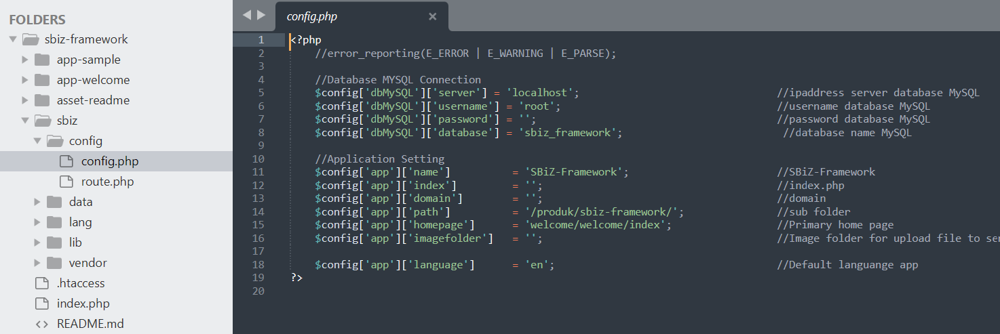
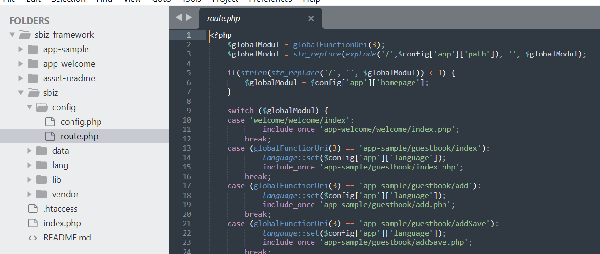
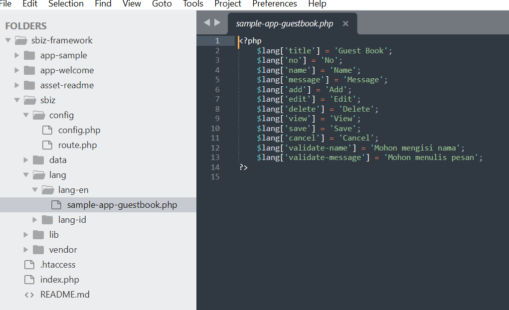
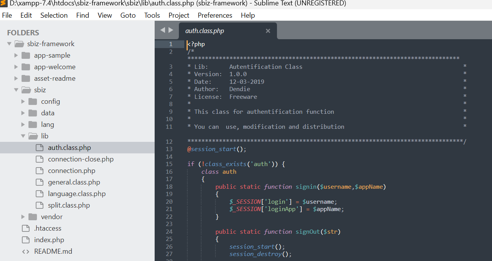
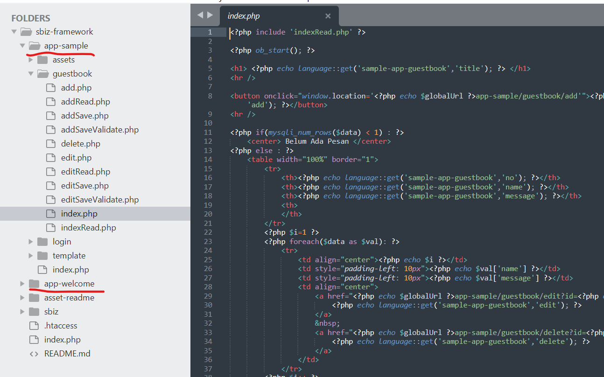

## Introducing
SBiZ Framework is a web application framework with Faster, Flexible, Secure, Eazy  (F2SE).

We’ve build this framework very eazy for using, so you time will focus to build you apps, "NOT wasting time for learning how to using framework".

SBiz Framwork have concept (F2SE):

Fast, This framework very light, bacause it not using unnecessary libraries
Flexible, This framework does not have strict rule, it give you big space to custome and creativiy with your style coding ,
you can make  varian or new framework from thisSecure, 

This framework is secure, you can using feature security (sanitation input for hanlde SQL Injection, XSS, Using Token for handle CSRF Attact, Brute Force Attack, Climbing Directory)

Eazy, we guaranted yout just need 15 minute to be master using this framework, all function and syntact in this framwork is native php, we no modification syntact php for same purposes, 
so  you dont need wasting time for read documentation or learning someting new for purpose same (learning curve very low)

##  SBiZ Framework have feature

1. Flexibel Routing

2. Smart URL

3. Token Protection (Security from CSRF, Brute Force Attack)

4. Modular (View and Model) in representative with same directory

5. Santition Variable (Antisipation for SQL Injection, XSS Attact, Click Jacking, Dos MySQL)

6. Handle File Inclusstion and Directory Transversal

7. Handle Directory List

## Structur Directory
<pre><code>
├── app*
├── sbiz
|   └── config
|       └── config.php
|       └── route.php    
|   └── data
|   └── lang    
|   └── lib
└── README.md
</code></pre>

- app*                     : Place name application
- sbiz/config/config.php   : Place for all define config variable global
- sbiz/config/config.php   : Place for all define routing 
- data                     : Place for migration create database and table
- lang                     : Place for define multiple language
- lib                      :  place for libray global framework 

## Simple Guide 
URL : https://dendieisme.blogspot.com/2019/11/sbiz-php-mvc-framework.html

**1. Create URL Config**

**2. Create URL route**

Route Pattern : "{{application_name_folder}}/{{moudle_name}}/{{sub_module_name}}"

**3. Create Multiple Languange**

**4. Lib Global**

**5 Application**

## Contact

If you have question, you can contact this email   
Email: dendie.sanjaya@gmail.com

## License

This project is licensed under the MIT License.
